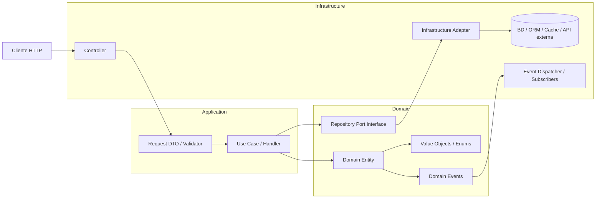

## Plan: Backend de Home

### TL;DR
Diseñar un backend PHP 8.3+ con arquitectura hexagonal, separando Domain, Application e Infrastructure para lograr un sistema extensible, escalable y probado. La lógica del negocio deberá vivir en el dominio, los casos de uso en la aplicación y la persistencia/HTTP en la infraestructura.

### Estado actual del proyecto

Se revisó el backend real y se validó que ya hay avance concreto en las primeras capas del plan:

- [x] Fase 0: proyecto base con Composer, autoload PSR-4 y estructura inicial.
- [x] Fase 1: dominio de tareas modelado con `Task`, `TaskTitle`, `TaskStatus` y repositorio de dominio.
- [x] Fase 2: caso de uso `CreateTask` implementado y probado a nivel de aplicación.
- [x] Fase 3: infraestructura HTTP/persistencia real y adaptadores concretos.
- [x] Fase 4: cobertura de pruebas extendida y validación de integración.
- [x] Fase 5: seguridad, despliegue y hardening de producción.

### 1. Estructura propuesta del proyecto

```text
home-backend/
├── composer.json
├── phpunit.xml
├── .env.example
├── README.md
├── src/
│   ├── Domain/
│   │   ├── Common/
│   │   │   ├── AggregateRoot.php
│   │   │   ├── DomainEvent.php
│   │   │   ├── Entity.php
│   │   │   └── ValueObject.php
│   │   ├── Users/
│   │   │   ├── User.php
│   │   │   ├── UserId.php
│   │   │   ├── Email.php
│   │   │   ├── UserRepositoryInterface.php
│   │   │   └── Events/
│   │   │       └── UserCreated.php
│   │   ├── Tasks/
│   │   │   ├── Task.php
│   │   │   ├── TaskId.php
│   │   │   ├── TaskTitle.php
│   │   │   ├── TaskStatus.php
│   │   │   ├── TaskPriority.php
│   │   │   ├── TaskRepositoryInterface.php
│   │   │   └── Events/
│   │   │       └── TaskCreated.php
│   │   ├── Households/
│   │   │   ├── Household.php
│   │   │   ├── HouseholdId.php
│   │   │   └── HouseholdRepositoryInterface.php
│   │   ├── Shared/
│   │   │   ├── ClockInterface.php
│   │   │   ├── UUIDGeneratorInterface.php
│   │   │   └── Exceptions/
│   │   │       ├── DomainException.php
│   │   │       └── InvalidTaskStateException.php
│   │   └── Contracts/
│   │       └── RepositoryPort.php
│   ├── Application/
│   │   ├── Common/
│   │   │   ├── CommandBus.php
│   │   │   ├── QueryBus.php
│   │   │   └── Result.php
│   │   ├── Users/
│   │   │   └── RegisterUser/
│   │   │       ├── RegisterUserCommand.php
│   │   │       ├── RegisterUserHandler.php
│   │   │       └── RegisterUserOutput.php
│   │   ├── Tasks/
│   │   │   ├── CreateTask/
│   │   │   │   ├── CreateTaskCommand.php
│   │   │   │   ├── CreateTaskHandler.php
│   │   │   │   └── CreateTaskOutput.php
│   │   │   ├── CompleteTask/
│   │   │   │   ├── CompleteTaskCommand.php
│   │   │   │   └── CompleteTaskHandler.php
│   │   │   └── ListTasks/
│   │   │       ├── ListTasksQuery.php
│   │   │       └── ListTasksHandler.php
│   │   └── DTOs/
│   │       ├── TaskDto.php
│   │       └── HouseholdDto.php
│   ├── Infrastructure/
│   │   ├── Http/
│   │   │   ├── Controllers/
│   │   │   │   ├── TaskController.php
│   │   │   │   └── UserController.php
│   │   │   ├── Requests/
│   │   │   │   ├── CreateTaskRequest.php
│   │   │   │   └── RegisterUserRequest.php
│   │   │   ├── Middleware/
│   │   │   │   ├── AuthMiddleware.php
│   │   │   │   └── ErrorHandlerMiddleware.php
│   │   │   └── Presenters/
│   │   │       └── JsonPresenter.php
│   │   ├── Persistence/
│   │   │   ├── Doctrine/
│   │   │   │   ├── TaskRepository.php
│   │   │   │   ├── UserRepository.php
│   │   │   │   ├── EntityMappers/
│   │   │   │   │   ├── TaskMapper.php
│   │   │   │   │   └── UserMapper.php
│   │   │   │   └── DoctrineConfig.php
│   │   │   └── PDO/
│   │   │       └── TaskQueryRepository.php
│   │   ├── Security/
│   │   │   ├── JwtTokenService.php
│   │   │   └── PasswordHasher.php
│   │   ├── Services/
│   │   │   ├── NotificationService.php
│   │   │   └── EmailSender.php
│   │   └── Bootstrap/
│   │       ├── Container.php
│   │       ├── Routes.php
│   │       └── App.php
│   └── Shared/
│       ├── Kernel/
│       │   └── AppKernel.php
│       ├── Config/
│       │   └── config.php
│       └── Helpers/
│           └── Str.php
├── tests/
│   ├── Unit/
│   │   ├── Domain/
│   │   │   ├── Tasks/
│   │   │   │   └── TaskTest.php
│   │   │   └── Users/
│   │   │       └── UserTest.php
│   │   └── Application/
│   │       └── Tasks/
│   │           └── CreateTaskHandlerTest.php
│   ├── Integration/
│   │   ├── Http/
│   │   │   └── TaskControllerTest.php
│   │   └── Persistence/
│   │       └── DoctrineTaskRepositoryTest.php
│   └── Feature/
│       └── HomeFlowTest.php
└── vendor/
```

### 2. Diagrama de componentes y flujo



### 3. Plan de desarrollo por fases

#### Fase 0: Preparación técnica
1. [x] Crear proyecto PHP 8.3+ con Composer.
2. [x] Definir PSR-12 y autoload PSR-4.
3. [x] Instalar PHPUnit/Pest, Doctrine ORM o DBAL, dotenv, UUID generator, PHPStan.
4. [x] Configurar phpunit.xml y CI básico.
5. [x] Definir `.env.example` y entorno de pruebas.

Hito: proyecto arrancable con estructura base y autoload correcto.

#### Fase 1: Dominio
1. [x] Identificar agregados: User, Household, Task.
2. [x] Elaborar entidades, value objects y enums.
3. [x] Definir invariantes del negocio:
   - título obligatorio
   - tarea no puede completarse dos veces
   - una tarea debe pertenecer a un hogar
4. [x] Crear interfaces de repositorio.
5. [x] Añadir eventos de dominio relevantes.
6. [x] Definir excepciones de dominio.

Hito: el negocio está modelado sin depender de HTTP, base de datos ni framework.

#### Fase 2: Casos de uso
1. [x] Crear DTOs de entrada y salida.
2. [x] Definir comandos y queries: CreateTask, CompleteTask, ListTasks.
3. [x] Implementar handlers con inyección de puertos.
4. [x] Mantener dependencias solo hacia interfaces del dominio.
5. [x] Evitar lógica de infraestructura dentro del caso de uso.

Hito: la aplicación orquesta el flujo del negocio sin depender de detalles técnicos.

#### Fase 3: Infraestructura
1. [x] Crear controladores HTTP.
2. [x] Implementar validación de requests.
3. [x] Crear adaptadores de persistencia con Doctrine o PDO.
4. [x] Definir servicios externos (notificaciones, JWT, hash de contraseñas).
5. [x] Registrar routes, middleware y contenedor de dependencias.

Hito: la API permite interactuar con la lógica del negocio de forma desacoplada.

#### Fase 4: Testing
1. [x] Escribir pruebas unitarias de dominio.
2. [x] Probar casos de uso en aplicación.
3. [x] Ejecutar pruebas de integración con base de datos real o SQLite.
4. [x] Verificar contratos y excepciones.

Cobertura objetivo:
- Dominio: 90%+
- Aplicación: 85%+
- Infraestructura: casos críticos cubiertos

#### Fase 5: Seguridad y despliegue
1. [x] Autenticación con JWT.
2. [x] Autorizar usuarios por hogar.
3. [x] Logs estructurados.
4. [x] CI/CD con phpunit + phpstan.
5. [x] Docker y migraciones de esquema.

Hito: la app queda lista para entorno de producción.

### 4. Principios SOLID y arquitectura

- S: cada clase tiene una única razón de cambio.
- O: permitir extensión sin modificar clases existentes.
- L: subtipos reemplazables sin romper contrato.
- I: interfaces pequeñas y específicas.
- D: depender de abstracciones y no de implementaciones.

### 5. Ejemplo de código PHP 8 de caso de uso: Crear Tarea del Hogar

```php
<?php

declare(strict_types=1);

namespace App\Domain\Tasks;

enum TaskStatus: string
{
    case PENDING = 'pending';
    case IN_PROGRESS = 'in_progress';
    case COMPLETED = 'completed';
}

readonly class TaskTitle
{
    public function __construct(
        private string $value
    ) {
        if (trim($value) === '') {
            throw new \InvalidArgumentException('Task title cannot be empty.');
        }

        $this->value = trim($value);
    }

    public function value(): string
    {
        return $this->value;
    }
}

class Task
{
    public function __construct(
        private readonly string $id,
        private TaskTitle $title,
        private TaskStatus $status = TaskStatus::PENDING,
        private readonly string $householdId,
        private readonly \DateTimeImmutable $createdAt,
        private ?\DateTimeImmutable $completedAt = null
    ) {
    }

    public static function create(
        string $id,
        string $title,
        string $householdId,
        \DateTimeImmutable $createdAt
    ): self {
        return new self(
            id: $id,
            title: new TaskTitle($title),
            householdId: $householdId,
            createdAt: $createdAt
        );
    }

    public function complete(): void
    {
        if ($this->status === TaskStatus::COMPLETED) {
            throw new \RuntimeException('Task is already completed.');
        }

        $this->status = TaskStatus::COMPLETED;
        $this->completedAt = new \DateTimeImmutable();
    }

    public function id(): string
    {
        return $this->id;
    }

    public function title(): TaskTitle
    {
        return $this->title;
    }

    public function status(): TaskStatus
    {
        return $this->status;
    }

    public function householdId(): string
    {
        return $this->householdId;
    }
}

interface TaskRepositoryInterface
{
    public function save(Task $task): void;
    public function findById(string $id): ?Task;
}

namespace App\Application\Tasks\CreateTask;

readonly class CreateTaskCommand
{
    public function __construct(
        public string $title,
        public string $householdId,
        public string $userId
    ) {
    }
}

final class CreateTaskHandler
{
    public function __construct(
        private readonly \App\Domain\Tasks\TaskRepositoryInterface $taskRepository
    ) {
    }

    public function handle(CreateTaskCommand $command): \App\Domain\Tasks\Task
    {
        $task = \App\Domain\Tasks\Task::create(
            id: uniqid('task_', true),
            title: $command->title,
            householdId: $command->householdId,
            createdAt: new \DateTimeImmutable()
        );

        $this->taskRepository->save($task);

        return $task;
    }
}

namespace App\Infrastructure\Persistence;

use App\Domain\Tasks\Task;
use App\Domain\Tasks\TaskRepositoryInterface;

final class InMemoryTaskRepository implements TaskRepositoryInterface
{
    /** @var array<string, Task> */
    private array $tasks = [];

    public function save(Task $task): void
    {
        $this->tasks[$task->id()] = $task;
    }

    public function findById(string $id): ?Task
    {
        return $this->tasks[$id] ?? null;
    }
}
```

### 6. Resumen de decisiones clave
- PHP 8.3+ con typing estrictos, readonly y enums.
- Domain, Application e Infrastructure separadas y dependientes en sentido correcto.
- Repositorios como puertos con implementaciones concretas en infraestructura.
- Testing desde el dominio hacia la infraestructura, con PHPUnit/Pest.
- API REST orientada a evitar acoplamiento con la base de datos.

### 7. Siguientes pasos
1. [x] Validar este plan con la estructura real del proyecto.
2. [x] Definir el primer conjunto de entidades y repositorios del dominio.
3. [x] Implementar el primer caso de uso: Crear tarea del hogar.
4. [x] Continuar con el siguiente caso de uso: completar tarea del hogar.
5. [x] Cubrir pruebas unitarias y de integración antes de ampliar funcionalidad.
